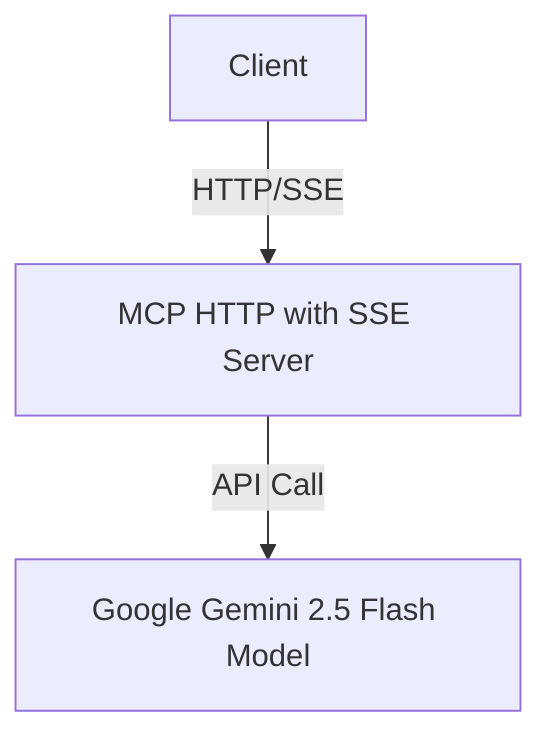

# AI Agent with Model Context Protocol (MCP) Server of HTTP with SSE and Google Gemini 2.5 Flash Model

## Overview

This project implements an AI Agent server that utilizes the **Model Context Protocol (MCP)** over HTTP, enhanced with **Server-Sent Events (SSE)** for real-time communication. It is designed to facilitate seamless and efficient client-server interactions for AI-based tasks, leveraging the power of the **Google Gemini 2.5 Flash Model** for advanced natural language processing.

The server is built to act as a bridge between AI model inference and client-side applications, providing streaming responses, low-latency connectivity, and scalable integration for a variety of use cases, such as chatbots, code review agents, and other intelligent assistants.

---

## Key Features

- **Model Context Protocol (MCP) Implementation:**  
  The server follows the MCP standard, allowing structured communication between clients and the AI agent, including context management, prompt exchange, and response tracking.

- **HTTP & Server-Sent Events (SSE):**  
  Real-time, one-way communication from server to client using SSE, providing live streaming of AI responses and status updates.

- **Google Gemini 2.5 Flash Model Integration:**  
  Out-of-the-box support for invoking the Gemini 2.5 Flash model, enabling state-of-the-art language and code understanding capabilities.

- **Extensible & Modular:**  
  Designed for easy integration with other models, protocols, and front-end clients.

- **Secure & Scalable:**  
  Leverages HTTP standards and can be deployed in modern cloud environments with scalability and security best practices.

---

## Architecture


MCP of HTTP with SSE Server's Workflow


- **Client:** Sends prompts/requests and receives streaming responses via SSE.
- **MCP SSE Server:** Handles protocol logic, manages context, and communicates with the Gemini model.
- **Google Gemini Model:** Provides AI inference and generates responses.

---

## Use Cases

- AI-powered chatbots with real-time streaming
- Automated regular basic tasks.

---

## Getting Started

### Prerequisites

- Node.js (or language/runtime as per your implementation)
- Access to Google Gemini 2.5 Flash API (API key/configuration)
- Git

### Installation

```bash
git clone https://github.com/sabbirkhanoni/AI-Agent-with-Model-Context-Protocol-MCP-Server-of-HTTP-with-SSE-and-Google-Gemini-2.5-Flash-Model.git
cd AI-Agent-with-Model-Context-Protocol-MCP-Server-of-HTTP-with-SSE-and-Google-Gemini-2.5-Flash-Model
npm install
```

### Configuration

Create a `.env` file and set your Gemini API key and other environment variables as needed:

```env
GEMINI_API_KEY=your_google_gemini_api_key
PORT=****
```

### Running the Server

```bash
npm start
```

The server will be available at `http://localhost:****`.

---

## Contributing

Contributions, issues, and feature requests are welcome!  
Please open an issue or submit a pull request.

---

## Acknowledgements

- [Google Gemini 2.5 Flash Model](https://ai.google.dev/)
- [Model Context Protocol (MCP)](https://github.com/modelcontext/protocol)
