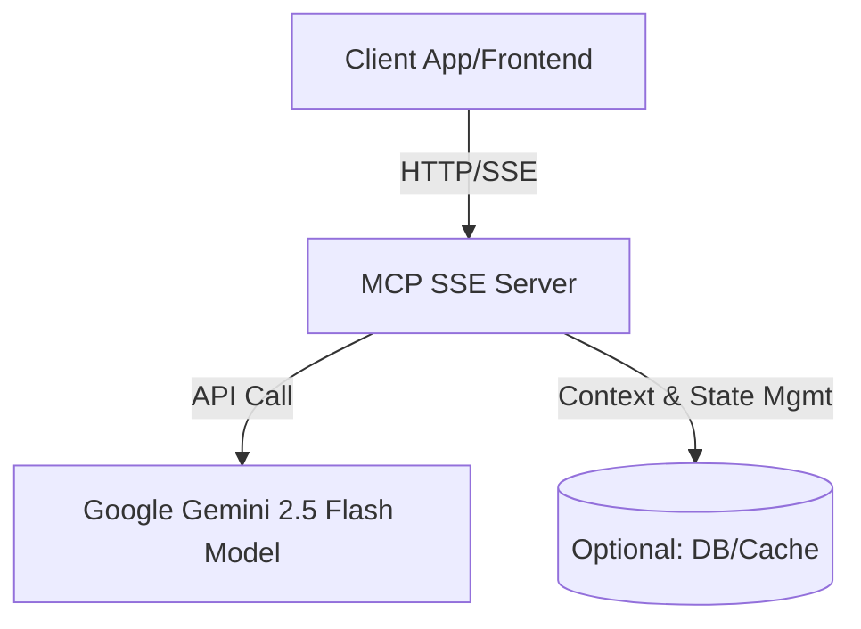

# AI Agent with Model Context Protocol (MCP) Server of HTTP with SSE and Google Gemini 2.5 Flash Model

## Overview

This project implements an AI Agent server that utilizes the **Model Context Protocol (MCP)** over HTTP, enhanced with **Server-Sent Events (SSE)** for real-time communication. It is designed to facilitate seamless and efficient client-server interactions for AI-based tasks, leveraging the power of the **Google Gemini 2.5 Flash Model** for advanced natural language processing.

The server is built to act as a bridge between AI model inference and client-side applications, providing streaming responses, low-latency connectivity, and scalable integration for a variety of use cases, such as chatbots, code review agents, and other intelligent assistants.

---

## Key Features

- **Model Context Protocol (MCP) Implementation:**  
  The server follows the MCP standard, allowing structured communication between clients and the AI agent, including context management, prompt exchange, and response tracking.

- **HTTP & Server-Sent Events (SSE):**  
  Real-time, one-way communication from server to client using SSE, providing live streaming of AI responses and status updates.

- **Google Gemini 2.5 Flash Model Integration:**  
  Out-of-the-box support for invoking the Gemini 2.5 Flash model, enabling state-of-the-art language and code understanding capabilities.

- **Extensible & Modular:**  
  Designed for easy integration with other models, protocols, and front-end clients.

- **Secure & Scalable:**  
  Leverages HTTP standards and can be deployed in modern cloud environments with scalability and security best practices.

---

## Architecture



- **Client:** Sends prompts/requests and receives streaming responses via SSE.
- **MCP SSE Server:** Handles protocol logic, manages context, and communicates with the Gemini model.
- **Google Gemini Model:** Provides AI inference and generates responses.
- **Database (Optional):** Used for storing context, sessions, or logs.

---

## Use Cases

- AI-powered chatbots with real-time streaming
- Automated code reviewers and suggesters
- Intelligent assistants for documentation or support
- Any application requiring fast, contextual AI responses

---

## Getting Started

### Prerequisites

- Node.js (or language/runtime as per your implementation)
- Access to Google Gemini 2.5 Flash API (API key/configuration)
- Git

### Installation

```bash
git clone https://github.com/sabbirkhanoni/AI-Agent-with-Model-Context-Protocol-MCP-Server-of-HTTP-with-SSE-and-Google-Gemini-2.5-Flash-Model.git
cd AI-Agent-with-Model-Context-Protocol-MCP-Server-of-HTTP-with-SSE-and-Google-Gemini-2.5-Flash-Model
npm install
```

### Configuration

Create a `.env` file and set your Gemini API key and other environment variables as needed:

```env
GEMINI_API_KEY=your_google_gemini_api_key
PORT=3000
```

### Running the Server

```bash
npm start
```

The server will be available at `http://localhost:3000`.

---

## API Endpoints

- `POST /mcp`  
  Accepts client prompts/requests and initiates AI processing.

- `GET /events`  
  SSE endpoint for clients to receive real-time responses.

- (Other endpoints as defined in your implementation)

---

## Example Usage

Client initiates a request:

```http
POST /mcp
Content-Type: application/json

{
  "session_id": "abc123",
  "prompt": "Summarize the latest research on AI agents.",
  "context": {...}
}
```

Client listens for SSE responses:

```javascript
const evtSource = new EventSource('http://localhost:3000/events?session_id=abc123');
evtSource.onmessage = function(event) {
  console.log("AI Response:", event.data);
};
```

---

## Project Structure

```
.
├── src/
│   ├── server.js
│   ├── mcp/
│   ├── sse/
│   ├── agents/
│   └── ...
├── package.json
├── README.md
└── .env.example
```

---

## Contributing

Contributions, issues, and feature requests are welcome!  
Please open an issue or submit a pull request.

---

## License

This project is licensed under the MIT License.

---

## Acknowledgements

- [Google Gemini 2.5 Flash Model](https://ai.google.dev/)
- [Model Context Protocol (MCP)](https://github.com/modelcontext/protocol)
- [Node.js](https://nodejs.org/)
- Your support and contributions!
